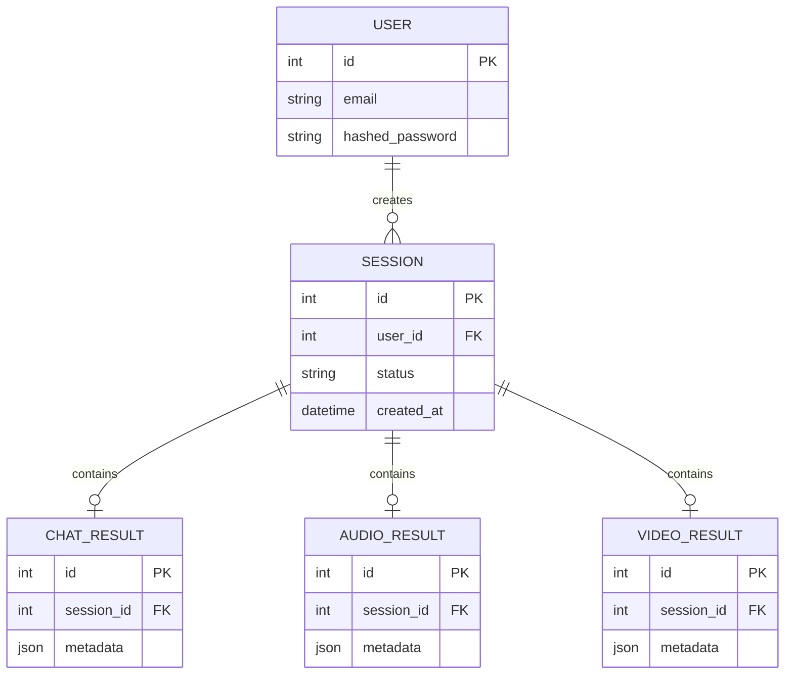
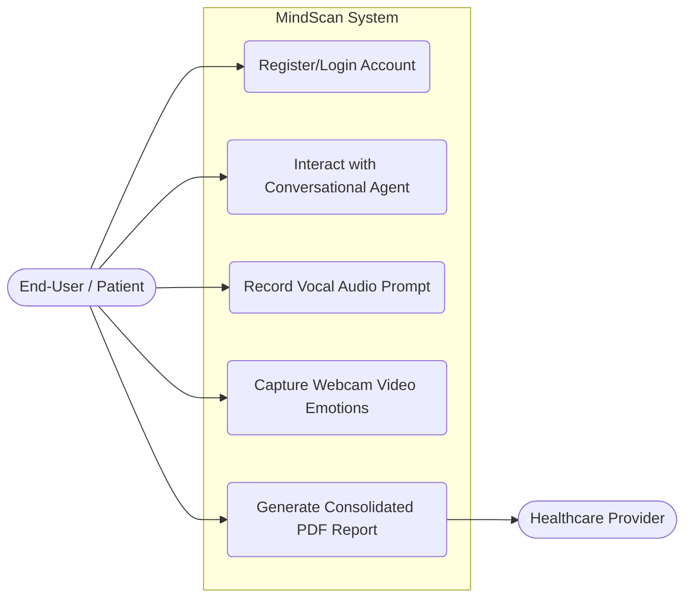
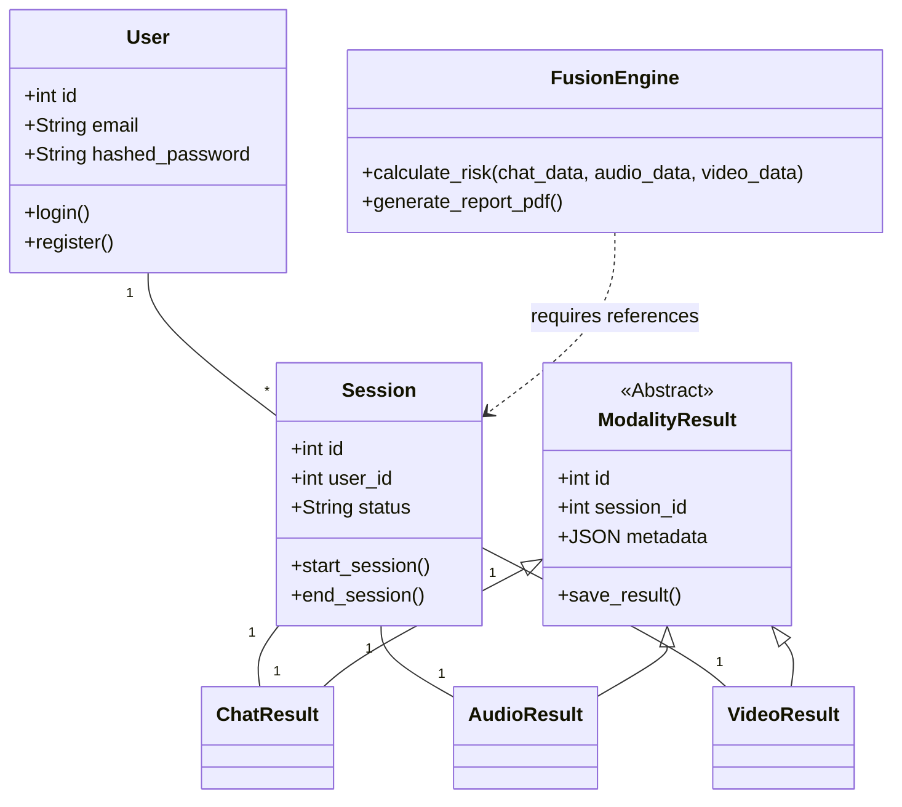
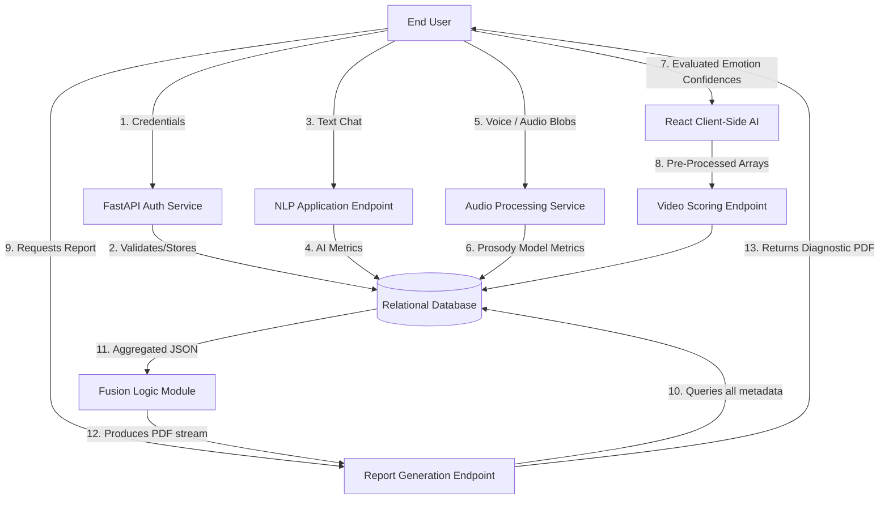
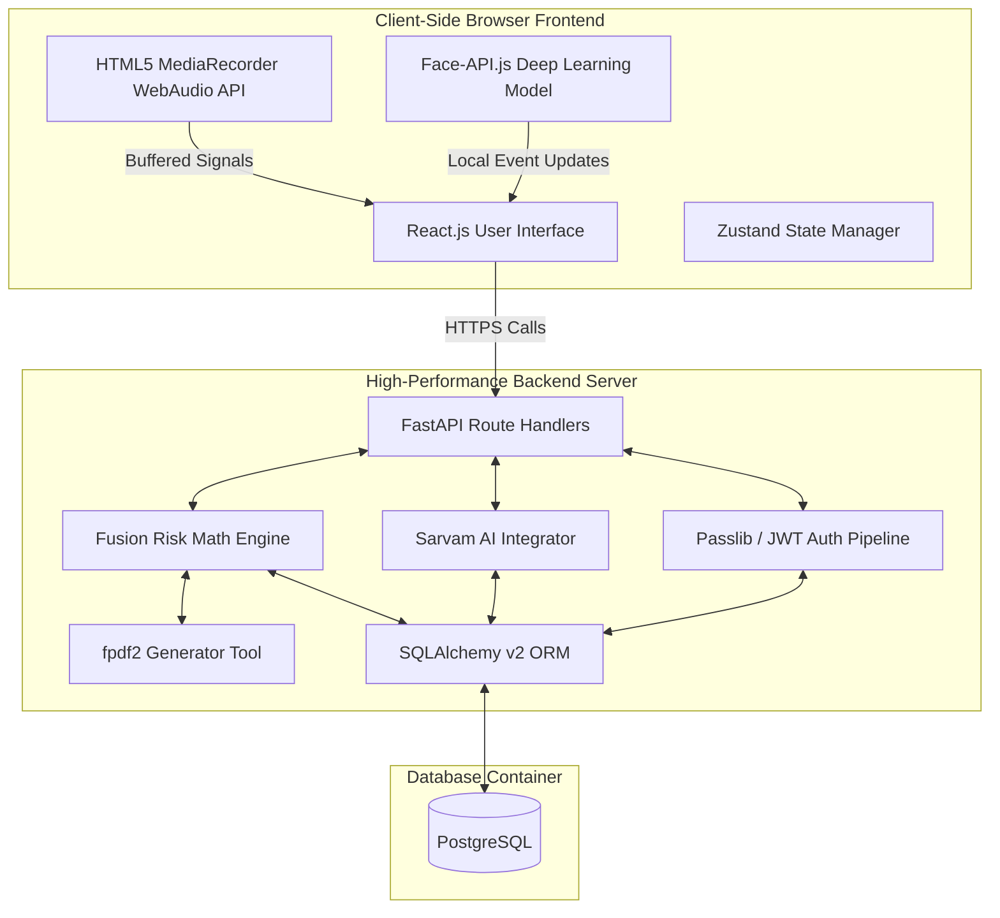
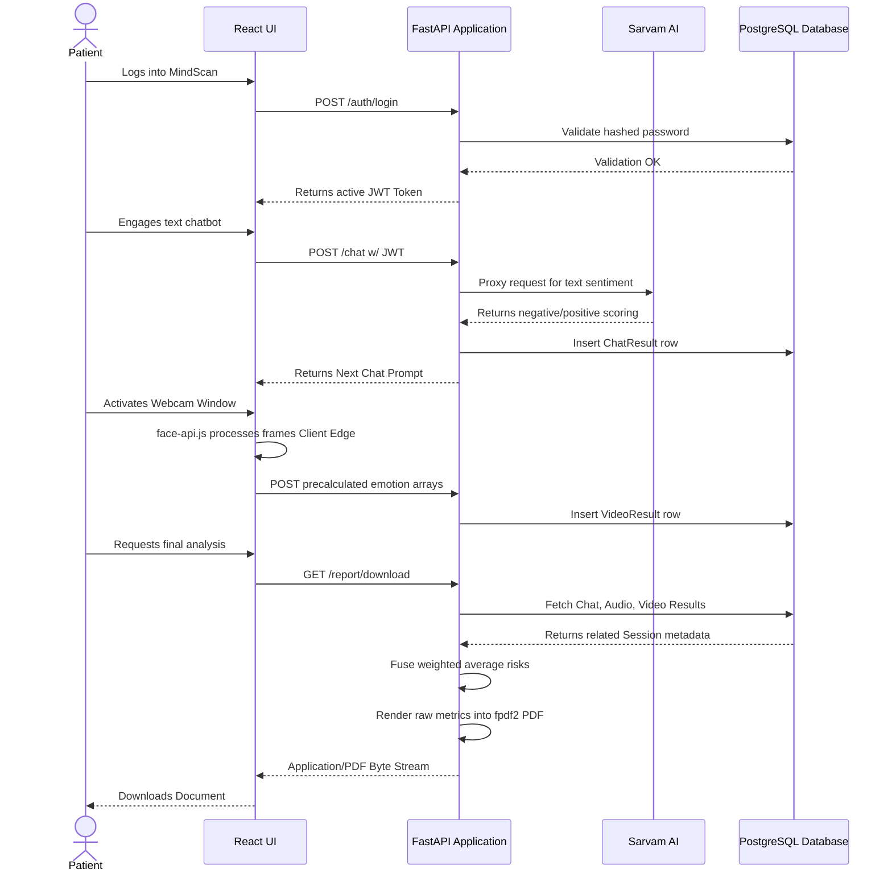
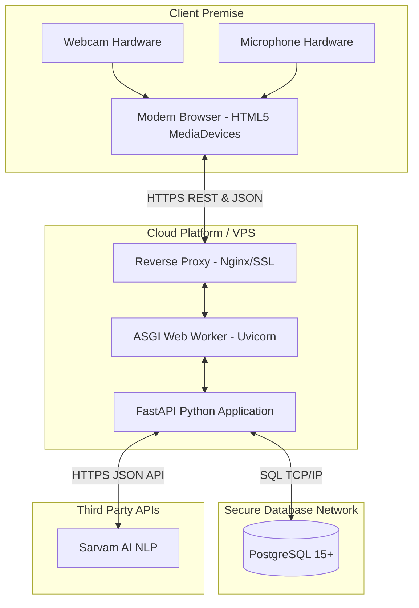

# MindScan: Technical Architecture Document

## 1. Application Architecture

**Selected Architecture:** Decoupled Monolithic Architecture (Client-Server)

**Detailed Explanation & Justification:**
The MindScan project adopts a Decoupled Monolithic Architecture, where the system is cleanly divided into a rich frontend client (React/Vite) and a centralized monolithic backend (FastAPI/Python), decoupled via RESTful APIs. 

While Microservices provide granular scalability, they introduce unnecessary overhead, complex container orchestration, and network latency—factors that are highly detrimental to a small team executing rapid iterations. Event-Driven architecture and Serverless architectures were considered but ultimately discarded. Serverless functions suffer from "cold starts" which could disrupt the fluidity of the real-time AI report generation, and an Event-Driven setup would overcomplicate the sequential, straightforward nature of the user's session states (Login -> Chat -> Audio -> Video -> Report).

A Decoupled Monolithic backend is highly justified because:
1. **Performance:** Running FastAPI as a single service async application leverages an unblocked event loop, allowing rapid database transactions and integration with the Fusion Engine without inter-service RPC calls.
2. **Edge Computing:** The architecture intentionally pushes heavy, high-latency computational work (such as the Video processing using `face-api.js`) to the client-side edge. The backend only handles light JSON storage, Sarvam AI integrations, and the final deterministic mathematical fusion.
3. **Simplicity & Maintainability:** A single backend repository with localized standard relational database connections is significantly easier to develop, debug, and deploy. 

---

## 2. Database Design

The data persistence layer relies on a relational model (PostgreSQL/SQLite) mapped via SQLAlchemy ORM. The relational schema heavily utilizes Foreign Key cascading for data integrity.

### 2.1 Schema Design
* **User Entity:** Stores the fundamental account information (`id`, `email`, `hashed_password`). Passwords are salted and hashed via bcrypt before insertion.
* **Session Entity:** Acts as the parent container tracking a unified diagnostic trial (`id`, `user_id`, `status`, `created_at`).
* **Modality Results (ChatResult, AudioResult, VideoResult):** These are child tables tied to the Session via foreign keys. Instead of rigidly typing every AI metadata metric, they utilize JSON/VARCHAR columns to gracefully store algorithmically generated arrays (e.g., Sentiment scores, PHQ-9 flags, emotion confidence bounds).

### 2.2 Entity-Relationship (ER) Diagram

---

## 3. Data Exchange Contract

MindScan relies on a strict data exchange contract between its decoupled layers to securely manage real-time diagnostic captures without leaking raw biometric records.

### 3.1 Frequency of Data Exchanges
* **Continuous Edge Aggregation:** The webcam processes frames at ~10-15 FPS entirely locally in the browser. Network exchanges do not occur per frame; instead, the browser averages the emotion arrays over a 30-second sliding window and sends a single deterministic JSON payload upon completion.
* **Chucked Streaming Responses:** Audio modalities transfer 15 to 30-second WAV audio buffers per step.
* **Turn-based Asynchronous Polling:** Chat messages trigger an API call immediately after the user sends text to evaluate sentiment with the Sarvam AI NLP modules. 

### 3.2 Data Sets
* **Authentication Data:** JWT tokens attached to HTTP headers, holding encoded `user_id` and signatures.
* **Visual/Audio Metadata:** Array variables, tracking percentages for core emotions (Happy, Sad, Neutral, Disgust), and acoustic features like Pitch Mean (~140-165Hz). 
* **Conversational Logs:** String objects containing raw user prompts, and structured dictionaries denoting PHQ-9 trigger occurrences.
* **Reporting Data:** Streamed application/pdf binary bytes holding the final fused result.

### 3.3 Mode of Exchanges
The primary communication mode is **REST API** operating over standard HTTP/HTTPS channels.
* **JSON (application/json):** Used for lightweight parameter transmission (login requests, chat text loops, algorithm weight uploads).
* **Multi-Part Form Data (multipart/form-data):** Exclusively utilized to transfer the raw Audio BLOBs securely.
* **Streaming Response:** Used to serve the generated fpdf2 PDF files without forcing the browser to load oversized blobs in local memory layout.

---

## 4. System Diagrams

### 4.1 Use Case Diagram

### 4.2 Class Diagram

### 4.3 Data Flow Diagram (DFD)

### 4.4 Component Diagram

### 4.5 Sequence Diagram

### 4.6 Deployment Diagram

